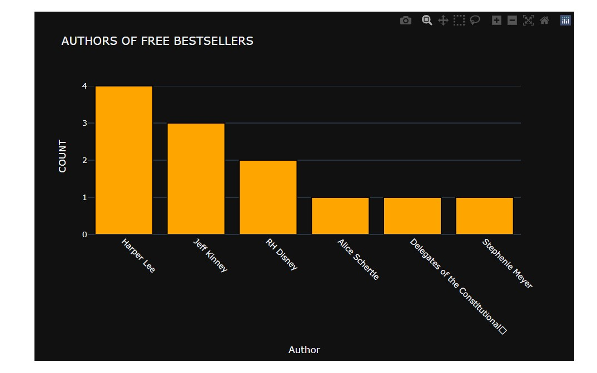
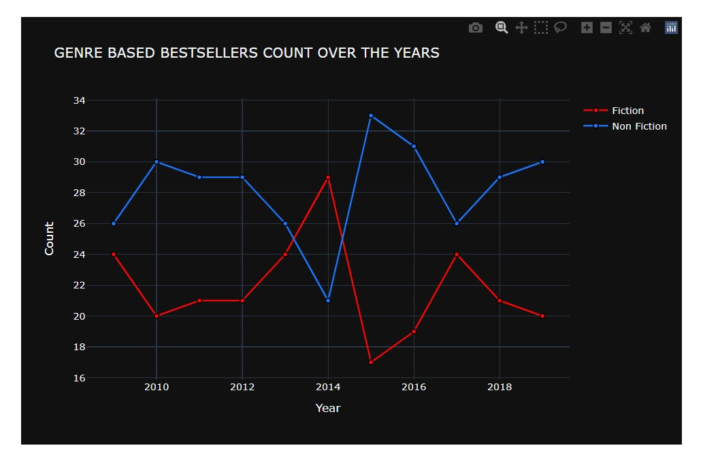

  

**Amazon Books Analysis**

  

**GOAL**

  
Analysis of the books from Amazon website.
  

**DATASET**

  

https://www.kaggle.com/sootersaalu/amazon-top-50-bestselling-books-2009-2019

  

  

**WORK DONE**

* Analyzed the data and found insights and plotted graphs accordingly etc.
* Found detailed insights of different columns with one another using plotting libraires. (`refer: amazon-bestselling-books.ipynb`)

**LIBRARIES NEEDED**

* Numpy
* Pandas
* Matplotlib
* seaborn
* Plotly
  
  

**PLOTS**

**CONCLUSION**

  

We investigated the data, checking for data unbalancing, visualizing the features, and understanding the relationship between different features.
Few insights were:
* The Data has no missing values
* Reviews and Price also tend to show an almost similar correlation as User Rating and Price.But again as most of the Bestsellers are crowded in a lower Price range,we can't conclude much.
* For ratings less than 4.8,Non-Fiction books count overpowers Fiction books. But the reverse can be seen for the ratings-4.8 and 4.9.This is an important point as ,earlier we have seen that non-fiction books have an overall higher count in the entire dataset.
* No FREE bestsellers in 2012 and after 2017. 
  

**CONTRIBUTION BY**

*Sankalp Srivastava*

  
  
