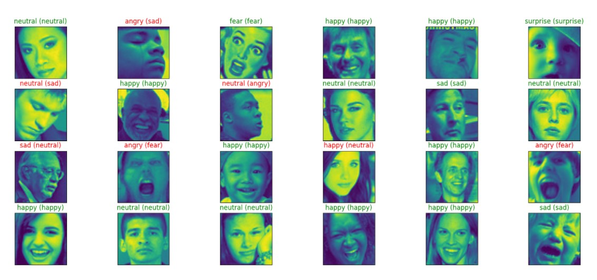

**Classify the emojis**

**DATASET**

  
https://www.kaggle.com/msambare/fer2013

**DESCRIPTION**

The main aim of the project is to predict the given emotions in the image.

  

**WORK DONE**

* Downloaded the dataset from the source.
* Used tensorflow data generator to generate the train and validalidation dataset.
* Created a sequential CNN keras model with output activation as softmax with 7 nodes.
* Added early stopping checkpointer to monitor accuracy over validation dataset to prevent overfitting.
* After Training, model visualization is done to see model performance over each epochs.
* Trained model is saved with .h5 extension to be used for later.(refer : `face-emotion-recognition-using-tensorflow.ipynb`)

  

**MODELS USED**

*Keras Sequential Model* : 
1. User-Friendly and Fast Deployment
Keras is a user-friendly API and it is very easy to create neural network models with Keras. It is good for implementing deep learning algorithms and natural language processing. We can build a neural network model in just a few lines of code.

2. Quality Documentation and Large Community Support
Keras has one of the best documentations ever. Documentation introduces you to each function in a very organized and sequential way. The codes and the examples given are very useful to understand the behavior of the method.

3. Multiple Backend and Modularity
Keras provides multiple backend support, where Tensorflow, Theano and CNTK being the most common backends. We can choose any of these backends according to the needs for different projects.

4. Pretrained models
Keras provides some deep learning models with their pre-trained weights. We can use these models directly for making predictions or feature extraction.

5. Multiple GPU Support
Keras allows us to train our model on a single GPU or use multiple GPUs. It provides built-in support for data parallelism. It can process a very large amount of data.

**LIBRARIES NEEDED**

* Numpy
* Pandas
* Matplotlib
* scikit-learn
* tensorflow
* pillow
  
  

**PERFORMANCE**

Dataset Example

Prediction

Model Layout

**CONCLUSION**

  

We created a model which takes (48,48) size input and predict the emotion as angry, disgust, fear, happy, neutral, sad and surprise. The model has accuracy of 63.19% on test dataset.

  

**CONTRIBUTION BY**

*Sankalp Srivastava*

  
  
